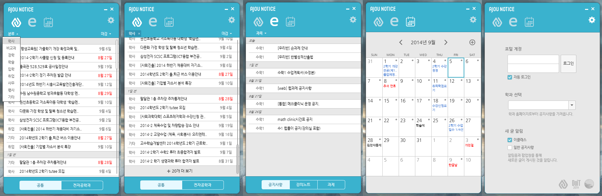

# Ajou Notice

**[▶ Prototype](https://ajou-notice-ui.netlify.app)**

A desktop widget that pulls [Ajou University](https://www.ajou.ac.kr/)'s notices and course
information straight from the school portal, so checking them doesn't mean
opening the portal itself.

## Screenshots

## Notes

- Notices are organized by category (학사/비교과/장학/학술/입학/취업/사무/행사/기타)
  and by department, with separate tabs for course-specific notices, lecture
  notes, and assignments, plus a calendar view — all synced from a logged-in
  portal account.
- Built and exhibited as team Droplet, part of DoIT's 20th generation, for
  an academic festival.

## About

- **Team:** Droplet (primarily [sokdak](https://github.com/sokdak), see [sokdak/Ajou-Notice](https://github.com/sokdak/Ajou-Notice))
- **Timeline:** 2014-08-28 – 2014-09-24
- **Environment:** Adobe Flash CS6, ActionScript 2
- **Language:** Korean

---
[github.com/canplane/Ajou-Notice-ui](https://github.com/canplane/Ajou-Notice-ui)
